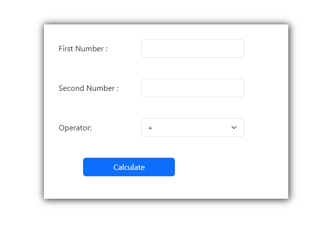

## Description
A basic calculator web application created using PHP. This application allows users to perform simple arithmetic operations (addition, subtraction, multiplication, division) on two numbers. The result is displayed in a centered and larger text for better visibility. This project is a simple demonstration of PHP form handling and basic arithmetic operations.

## Screenshots

